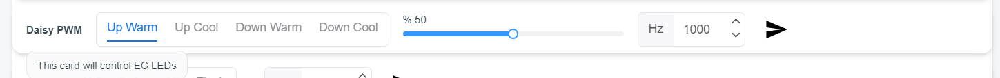

# UART Setting

| Setting  | Value                                                                             |
| -------- | --------------------------------------------------------------------------------- |
| baudRate | 9600, 19200, 38400, 57600, 115200, 230400, 460800, 500000, 576000, 921600,1000000 |
| dataBits | 8                                                                                 |
| stopBits | 1                                                                                 |
| parity   | none                                                                              |

---

# DGSD JSON Structure
This is a JSON example for DGSD with a single card. The format is consistent across all JSON files, varying only by the type and number of cards in a project. To add more cards, insert a card configuration object into the **cards** array.

**DGSD example JSON:**

```json
{
	"projectName": "Example",
	"version": "1.0.3",
	"cards": [
		{
			"Buttons": {
				"command": "refresh",
				"help": "This card triggers the board to refresh relevant sections.",
				"type": "button",
				"sections": [
					{
						"type": "button",
						"config": {
							"Filter": {
								"active": "hall filter",
								"colour": "red"
							},
							"Arm": {
								"active": "hall arm",
								"colour": "orange"
							},
							"Accelerometer": {
								"active": "accel read",
								"colour": "yellow"
							},
							"ADC": {
								"active": "adc read 5v",
								"colour": "green"
							},
							"Flash": {
								"active": "flash",
								"colour": "cyan"
							},
							"UART": {
								"active": "uart write hc hello",
								"colour": "violet"
							}
						}
					}
				]
			}
		}
	]
}
```

> [!Attention]
>
> -   You must have at least one card object.

**JSON structure:**

```json
{
	"projectName": "<Your Project's Name>",
	"version": "<Version in text>",
	"cards": [{}]
}
```

---

# Card Objects

Here, you'll discover the configuration for each card.

> [!Tip]
> How to interpret this section:  
> For items in the **JSON structure** sections, maintain identical spelling and case in your JSON.  
> If you encounter **""**, it indicates the expectation of **string** value.  
> If you encounter **{}**, it indicates the expectation of **JSON** object.  
> If you encounter **()**, it indicates the expectation of **integer** value. 
> If you encounter **[]**, it indicates the expectation of **array** object.  
> If you encounter **<>**, it indicates that the value is **mandatory**.

## Command Cards

### Button

**Card example:**


**JSON example:**

```json
{
	"Buttons": {
		"command": "refresh",
		"help": "This card triggers the board to refresh relevant sections.",
		"type": "button",
		"sections": [
			{
				"type": "button",
				"config": {
					"Filter": {
						"active": "hall filter",
						"colour": "red"
					},
					"Arm": {
						"active": "hall arm",
						"colour": "orange"
					},
					"Accelerometer": {
						"active": "accel read",
						"colour": "yellow"
					},
					"ADC": {
						"active": "adc read 5v",
						"colour": "green"
					},
					"Flash": {
						"active": "flash",
						"colour": "cyan"
					},
					"UART": {
						"active": "uart write hc hello",
						"colour": "violet"
					}
				}
			}
		]
	}
}
```

> [!Attention]
>
> -   Aim for concise labels, with a maximum of 15 characters to avoid visual clutter.
> -   Provide descriptive help for the tooltip.
> -   Limit the number of buttons to a maximum of 20.
> -   All commands transmitted to your board will have "\r\n" appended to the end.
> -   For example, pressing the "Filter" button will transmit "hall filter\r\n".
> -   When the send icon is clicked, the final command sent to your board is constructed as follows:
>
> ```js
> finalCommand =
> 	"Card's command" + "\r\n" + 'all elements commands joined with "\r\n" ';
> // e.g.
> finalCommand =
> 	"refresh\r\nhall filter\r\nhall arm\r\naccel read\r\nadc read 5v\r\nflash\r\nuart write hc hello\r\n";
> ```

**JSON structure:**

```json
{
	"<label>": {
		"command": "",
		"help": "",
		"type": "button",
		"sections": [
			{
				"type": "button",
				"config": {
					"<button name>": {
						"active": "<command to send when the button is pressed>",
						"colour": "<select from [red, orange, yellow, green, cyan, blue, violet]>"
					}
				}
			}
		]
	}
}
```

### Control

**Card example:**


**JSON example:**

```json
{
	"Control": {
		"command": "",
		"help": "This card controls state of the listed functions",
		"type": "control",
		"sections": [
			{
				"type": "control",
				"config": {
					"I2C": {
						"active": "task i2c start",
						"diactive": "task i2c stop",
						"colour": "red"
					},
					"Daisy": {
						"active": "task daisy start",
						"diactive": "task daisy stop",
						"colour": "orange"
					},
					"UI": {
						"active": "task ui start",
						"diactive": "task ui stop",
						"colour": "yellow"
					},
					"Flash": {
						"active": "task flash start",
						"diactive": "task flash stop",
						"colour": "green"
					},
					"AFMD": {
						"active": "afmd start",
						"diactive": "afmd stop",
						"colour": "cyan"
					},
					"UI Sequence": {
						"active": "ui sequence on",
						"diactive": "ui sequence off",
						"colour": "violet"
					}
				}
			}
		]
	}
}
```

> [!Attention]
>
> -   Aim for concise labels, with a maximum of 15 characters to avoid visual clutter.
> -   Provide descriptive help for the tooltip.
> -   Limit the number of controls to a maximum of 20.
> -   All commands transmitted to your board will have "\r\n" appended to the end.
> -   For example, when the "AFMD" switch is activated, the command "afmd start\r\n" will be sent.
> -   When the send icon is clicked, the final command sent to your board is assembled as follows:
>
> ```js
> finalCommand =
> 	"Card's command" +
> 	"\r\n" +
> 	'all commands corresponding to elements current state, joined with "\r\n" ';
> // e.g.
> finalCommand =
> 	"\r\ntask i2c start\r\ntask daisy stop\r\ntask ui start\r\ntask flash start\rafmd stop\r\nui sequence on\r\n";
> ```

**JSON structure:**

```json
{
	"<label>": {
		"command": "",
		"help": "",
		"type": "button",
		"sections": [
			{
				"type": "button",
				"config": {
					"<button name>": {
						"active": "<command to send when the switch becomes active>",
						"diactive": "<command to send when the switch becomes deactive>",
						"colour": "<select from [red, orange, yellow, green, cyan, blue, violet]>"
					}
				}
			}
		]
	}
}
```

### Mix

**Card example:**



**JSON example:**

```json
{
	"Daisy PWM": {
		"command": "daisy pwm ",
		"help": "This card will control LEDs",
		"type": "mix",
		"sections": [
			{
				"type": "mixselector",
				"config": {
					"Up Warm": "up_warm",
					"Up Cool": "up_cool",
					"Down Warm": "down_warm",
					"Down Cool": "down_cool"
				}
			},
			{
				"type": "invisible",
				"config": {
					"D": "duty"
				}
			},
			{
				"type": "mixslider",
				"config": {
					"prefix": "%",
					"min": 0,
					"max": 100,
					"step": 1
				}
			},
			{
				"type": "invisible",
				"config": {
					"fre": "frequency"
				}
			},
			{
				"type": "mixinput",
				"config": {
					"prefix": "Hz",
					"min": 0,
					"max": 100000,
					"step": 1
				}
			}
		]
	}
}
```

> [!Attention]
>
> -   Aim for concise labels, with a maximum of 15 characters to avoid visual clutter.
> -   Provide descriptive help for the tooltip.
> -   You need to have at least one section, and the maximum allowable number of sections is 5.
> -   It's possible to include multiple sections of the same type.
> -   When the send icon is clicked, the final command sent to your board is assembled as follows:
>
> ```js
> finalCommand =
> 	"Card's command" +
> 	" " +
> 	'all commands corresponding to each section joined with " " ' +
> 	"\r\n";
> // e.g.
> finalCommand = "daisy lc pwm up_warm duty 50 frequency 1000\r\n";
> ```

**JSON structure:**

```json
{
	"<label>": {
		"command": "",
		"help": "",
		"type": "mix",
		"sections": [
			{
				"type": "mixselector",
				"config": {
					"<key>": "<command to use when the key is selected>"
				}
			},
			{
				"type": "mixslider",
				"config": {
					"prefix": "",
					"min": "<non-negative numbers, smaller than max>",
					"max": "<positive number, bigger than min>",
					"step": "<positive number, smaller than max>"
				}
			},
			{
				"type": "mixinput",
				"config": {
					"prefix": "",
					"min": "<non-negative numbers, smaller than max>",
					"max": "<positive number, bigger than min>",
					"step": "<positive number, smaller than max>"
				}
			},
			{
				"type": "invisible",
				"config": {
					"": "<command to inject in between other sections>"
				}
			}
		]
	}
}
```

### Slider

**Card example:**


**JSON example:**

```json
{
	"Power": {
		"command": "Heater ",
		"help": "This card can control delivered power to the heating elements",
		"type": "slider",
		"sections": [
			{
				"type": "slider",
				"config": {
					"commands": "element1 ",
					"prefix": "W:",
					"onChangeSend": true,
					"min": 0,
					"max": 1200,
					"step": 10
				}
			}
		]
	}
}
```

> [!Attention]
>
> -   Aim for concise labels, with a maximum of 15 characters to avoid visual clutter.
> -   Provide descriptive help for the tooltip.
> -   If 'onChangeSend' is set to true, the 'finalCommand' is sent to your board either when the slider cursor is released or when you click on the slider's bar.
> -   When the send icon is clicked, the final command sent to your board is assembled as follows:
>
> ```js
> finalCommand =
> 	"Card's command" + "Slider's command" + "Slider's value" + "\r\n";
> // e.g.
> finalCommand = "Heater element1 1000\r\n";
> ```

**JSON structure:**

```json
{
	"<label>": {
		"command": "",
		"help": "",
		"type": "slider",
		"sections": [
			{
				"type": "slider",
				"config": {
					"commands": "",
					"prefix": "",
					"onChangeSend": "<true or false>",
					"min": "<non-negative numbers, smaller than max>",
					"max": "<positive number, bigger than min>",
					"step": "<positive number, smaller than max>"
				}
			}
		]
	}
}
```

### Gslider

**Card example:**


**JSON example:**

```json
{
	"Heater": {
		"command": "Heater ",
		"help": "Will update Heater temperature",
		"type": "gslider",
		"sections": [
			{
				"type": "gslider",
				"config": {
					"commandgs": "temp ",
					"unit": "°C",
					"onChangeSend": true,
					"min": 0,
					"max": 80,
					"step": 10
				}
			}
		]
	}
}
```

> [!Attention]
>
> -   Aim for concise labels, with a maximum of 15 characters to avoid visual clutter.
> -   Provide descriptive help for the tooltip.
> -   If 'onChangeSend' is set to true, the 'finalCommand' is sent to your board either when the slider cursor is released or when you click on the slider's bar.
> -   It shares similar functionality with the Slider card; however, instead of displaying a prefix, it exhibits the unit and snaps precisely at designated step points.
> -   When the send icon is clicked, the final command sent to your board is assembled as follows:
>
> ```js
> finalCommand =
> 	"Card's command" + "Gslider's command" + "Gslider's value" + "\r\n";
> // e.g.
> finalCommand = "Heater temp 40\r\n";
> ```

**JSON structure:**

```json
{
	"<label>": {
		"command": "",
		"help": "",
		"type": "gslider",
		"sections": [
			{
				"type": "gslider",
				"config": {
					"commandgs": "",
					"unit": "",
					"onChangeSend": "<true or false>",
					"min": "<non-negative numbers, smaller than max>",
					"max": "<positive number, bigger than min>",
					"step": "<positive number, smaller than max>"
				}
			}
		]
	}
}
```

### RGB

**Card example:**


**JSON example:**

```json
{
	"LED": {
		"command": "RGB",
		"help": "This card facilitates the transmission of values within the range of 0 to 255 for each color channel",
		"type": "rgb",
		"sections": [
			{
				"type": "rgb",
				"config": {
					"commandr": "ui red",
					"commandg": "ui green",
					"commandb": "ui blue",
					"onChangeSend": true,
					"min": 0,
					"max": 255,
					"step": 1
				}
			}
		]
	}
}
```

> [!Attention]
>
> -   Aim for concise labels, with a maximum of 15 characters to avoid visual clutter.
> -   Provide descriptive help for the tooltip.
> -   If 'onChangeSend' is set to true, the command sent to your board is constructed as following and sent to your board either when the slider cursor is released or when you click on the slider's bar.
>
> ```js
> onChangeCommand =
> 	'card command + " " + command associated with the altered slider + " " + value associated with the altered slider + "\r\n"';
> // e.g.
> onChangeCommand = "RGB ui red 178\r\n";
> ```
>
> -   When the send icon is clicked, the final command sent to your board is assembled as follows:
>
> ```js
> finalCommand =
> 	"Card's command" +
> 	" " +
> 	"commandr" +
> 	" " +
> 	"red value" +
> 	"\r\n" +
> 	"commandg" +
> 	" " +
> 	"green value" +
> 	"\r\n" +
> 	"commandb" +
> 	" " +
> 	"blue value" +
> 	"\r\n";
> // e.g.
> finalCommand = "RGB ui red 178\r\nui green 168\r\nui blue 182\r\n";
> ```

**JSON structure:**

```json
{
	"<label>": {
		"command": "",
		"help": "",
		"type": "rgb",
		"sections": [
			{
				"type": "rgb",
				"config": {
					"commandr": "",
					"commandg": "",
					"commandb": "",
					"onChangeSend": "<true or false>",
					"min": "<non-negative numbers, smaller than max>",
					"max": "<positive number, bigger than min>",
					"step": "<positive number, smaller than max>"
				}
			}
		]
	}
}
```

## Observe Cards

> [!Attention]
>
> The subsequent characters are reserved in messages transmitted to DGSD.
>
> -   "**|**" - Vertical bar -> Helps differentiate between the card's command used to invoke the card and the message specifically intended for the card.
> -   "**;**" - Semicolon -> Card dependent.
> -   "**:**" - Colon -> Card dependent.
> -   "**,**" - Comma -> Card dependent.

### Document

**Card example:**


**JSON example:**

```json
{
	"Document": {
		"command": "",
		"help": "This card provides the link to documents containing schematics, PCB information, and a detailed explanation of all functions available in the dashboard",
		"type": "document",
		"sections": [
			{
				"type": "document",
				"config": {
					"link": "https://github.com/akEmbeddedSW/dgsd/tree/trunk#/"
				}
			}
		]
	}
}
```

> [!Attention]
>
> -   Aim for concise labels, with a maximum of 15 characters to avoid visual clutter.
> -   Provide descriptive help for the tooltip.
> -   While the command value is unnecessary due to the redundancy of the command key, it's essential for the card object to include the "command" key with an empty string as its value.

**JSON structure:**

```json
{
	"<label>": {
		"command": "",
		"help": "",
		"type": "document",
		"sections": [
			{
				"type": "document",
				"config": {
					"link": "<A valid link>"
				}
			}
		]
	}
}
```

### Status

**Card example:**


**JSON example:**

```json
{
	"Status": {
		"command": "gpio",
		"help": "This card displays the status of listed buttons, indicating whether they are active or inactive.",
		"type": "status",
		"sections": [
			{
				"type": "status",
				"config": {
					"chips": {
						"Switch": "SW",
						"Power": "P",
						"Confirm": "C",
						"Navigation": "N",
						"Airflow 1": "A1",
						"Airflow 2": "A2"
					}
				}
			}
		]
	}
}
```

> [!Attention]
>
> -   Aim for concise labels, with a maximum of 15 characters to avoid visual clutter.
> -   Provide descriptive help for the tooltip.
> -   This card is constrained to a minimum of 1 status chip and a maximum of 20 status chips.
> -   This card expects a serial message to commence with the board's command.
> -   DGSD requires that all serial messages terminate with "\r\n".
> -   "**;**" - Semicolon -> Assists in distinguishing between key-state pairs for the chips.
> -   "**:**" - Colon -> Assists in distinguishing between the key and state of each chip.
> -   DGSD requires the following message for the example status card to update the state of each chip:
> -   0: Status Red/Square, 1: Status Green/Circle
> ```js
> // e.g.
> message = "gpio|SW:1;P:0;C:1;N:0;A1:1;A2:1\r\n";
> ```

**JSON structure:**

```json
{
	"<label>": {
		"command": "<command unique to this card>",
		"help": "",
		"type": "status",
		"sections": [
			{
				"type": "status",
				"config": {
					"chips": {
						"<Status name>": "Status key in the respond from your board"
					}
				}
			}
		]
	}
}
```

### Table

**Card example:**


**JSON example:**

```json
{
	"Hall Sensor": {
		"command": "filter",
		"help": "This table shows x, y, and z values for filter's hall sensor",
		"type": "table",
		"sections": [
			{
				"type": "table",
				"config": {
					"headers": ["X", "Y", "Z"],
					"rows": {
						"Filter": "filter",
						"Arm": "arm"
					}
				}
			}
		]
	}
}
```

> [!Attention]
>
> -   Aim for concise labels, with a maximum of 15 characters to avoid visual clutter.
> -   Provide descriptive help for the tooltip.
> -   This card has a minimum requirement of 1 header and 1 row, and a maximum limit of 20 headers and 20 rows.
> -   This card expects a serial message to commence with the board's command.
> -   DGSD requires that all serial messages terminate with "\r\n".
> -   "**;**" - Semicolon -> Assists in distinguishing between the data associated with each row.
> -   Within a given row, "**:**" - Colon -> Assists in distinguishing between the values of each column.
> -   The order of values following the row key is crucial, and it must align with the order of headers.
> -   To maintain data integrity, it is required to update all values simultaneously.
> -   DGSD requires the following message for the example table card to update the table:
>
> ```js
> // e.g.
> message = "filter|filter:125,-303,0.11;arm:33,-25,0.19\r\n";
> ```

**JSON structure:**

```json
{
	"<label>": {
		"command": "<command unique to this card>",
		"help": "",
		"type": "table",
		"sections": [
			{
				"type": "table",
				"config": {
					"headers": ["<Header name>"],
					"rows": {
						"<Row name>": "Row key in the respond from your board"
					}
				}
			}
		]
	}
}
```
