# Prerequisites

-   A compatible board or a JSON file supported by DGSD.
-   Board's UART baudrate.
-   FTDI Device Drivers (installable via Software Center).

# Dashboard
**Benefits:**
- Simplified Interaction
- Data Observation 
- Intuitive Board Commanding
- Rapid Onboarding
- Complexity Abstraction
- Accelerated Board Commissioning

## Choose Dashboard source

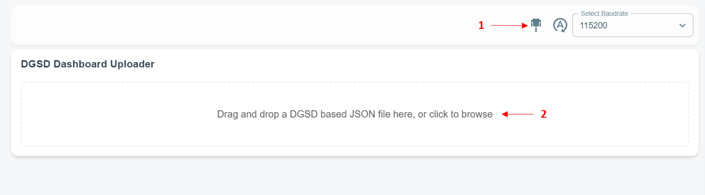

1. If the board is DGSD-compatible, query the board at [Connect](#Connect).
2. If you prefer using a JSON file or the board doesn't support DGSD, use the uploader (2).

> [!Note]
> Uploading a JSON file means DGSD won't query the board for the Dashboard.

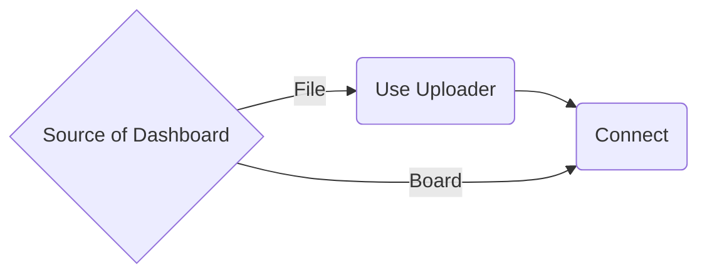

## Connect

1. Select the UART baudrate.
2. Click on Connect/Disconnect (1); a window will show all serial devices.  
   Select your board.

    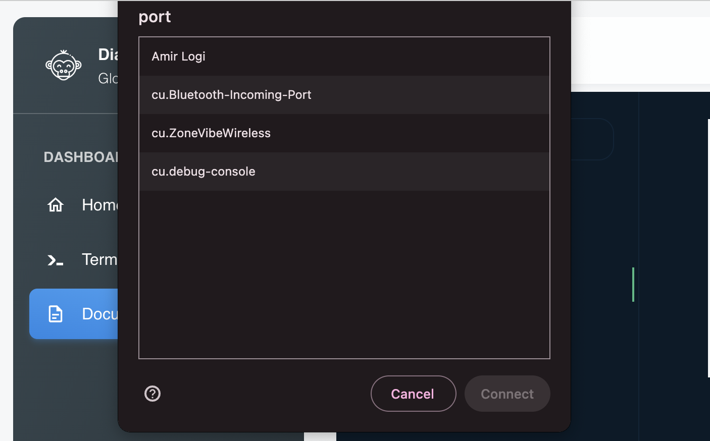

    > [!Tip]
    > If you're unsure which port belongs to your device:
    >
    > 1. Disconnect your board.
    > 2. Click on Connect/Disconnect (1); a window will show all serial devices.
    > 3. Reconnect your board, and your device will be added to the end of the list.

3. The Connect/Disconnect icon (1) changes its color to Sidenav Color if the connection is established.

    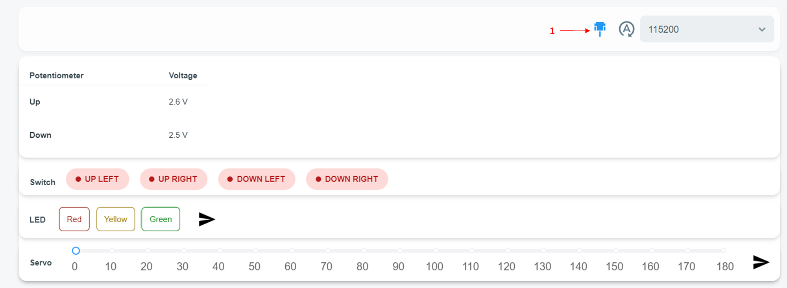

---

## Cards

Cards help you interact with your board.  
There are two types of cards: **Command** and **Observe**.  
**Command** cards send a change to your board, while **Observe** cards get information from your board.

### Command Cards

These cards have three sections: Label, Body, and Send.

**Label**
The card's name, which shows related information when hovered over.

**Body**
Contains all elements that form a command.

**Send**
Creates a command using the body's elements and sends it to your device.

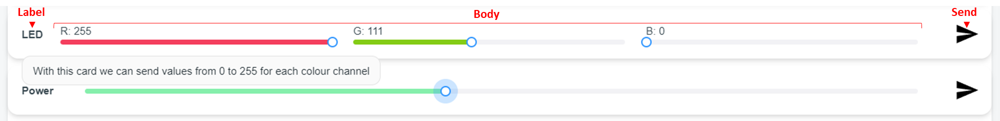

---

#### Button

This card works like a push button. When pressed, it sends the corresponding command to your board.

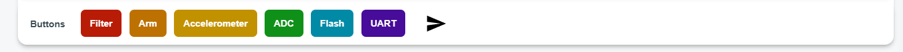

---

#### Control

This card works like a switch with two states, on and off.  
Pressing the switch changes its state to match the latest state-command sent to your board.  
The initial state for all switches is off.

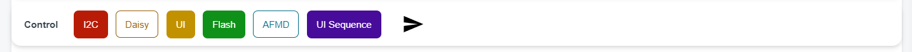

---

#### Mix

This card combines different element types.  
The image below shows a card made from a selector, slider, and input.  
Pressing send combines commands related to each element and sends it to your board.  
With the given settings, pressing send activates Up Cool PWM with a 46% duty and 1250 Hz frequency.

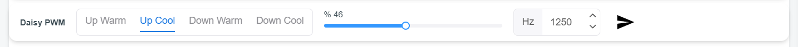

---

#### Slider

This card lets you select an integer value from a range and send it to your board.

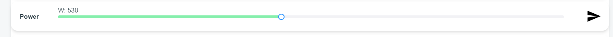

---

#### Gslider

This card lets you select an integer value from a range and send it to your board, similar to [slider](#Slider).  
It includes a latching mechanism for sending specific values more easily.

> [!Note]  
> **Usage:** Drag and release the slider or double-click on latching points.

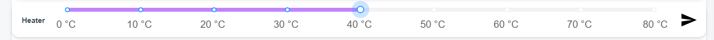

---

#### RGB

This card makes it easy to control an RGB LED using three dedicated sliders.  
All the sliders have the same range.

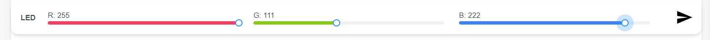

---

### Observe Cards

These cards have two sections: Label and Body.

**Label**
The card's name, which shows related information when hovered over.
**Body**
Contains all elements that display data sent from the board.

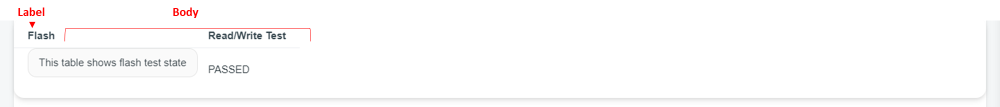

---

#### Document

This card provides a link to project-specific documentation.

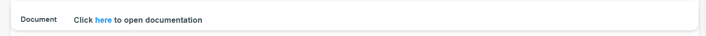

---

#### Status

This card shows the active or inactive state of an element.  
Green means active, and red means inactive.

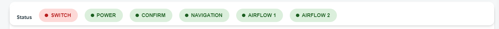

---

#### Table

This card is a table, and its leftmost header is its label.

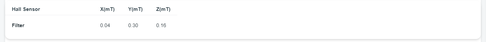

# Terminal

The terminal lets you communicate with legacy boards even if they don't have a DGSD dashboard.  
Connect to your board following [Connect](#Connect).

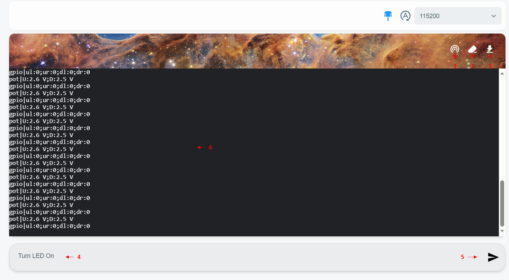

The DGSD terminal has the following sections:

1. **Echo:** Toggles between on and off. When on, typed text shows in the terminal; if off, the text is sent to the board but doesn't display.
2. **Clear:** Clears the terminal.
3. **Download:** Downloads terminal content as a .txt file.
4. **Message box:** Text typed here can be sent to your board at once.
5. **Send:** Use the Enter key in the message box or Send icon to send your message.
6. **Terminal:** Displays board and user messages. You can type in it, and each character is sent once typed.
